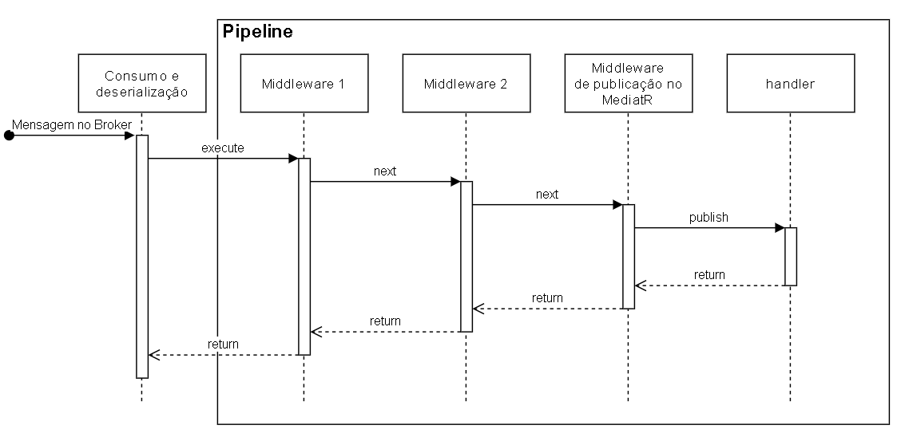

# Pipeline

> Qualquer dúvida acerca de algum termo desconhecido, acesse nosso [**_glossário_**](glossario.md)

O Bus, por ser uma implementação agnóstica ao contexto em que será utilizado, necessita de uma forma de facilitar a adição de novas funcionalidades dentro de seu fluxo sem que seja realizada alguma alteração em seu core.

## Afinal, o que é uma pipeline?

Uma pipeline é, a grosso modo, uma implementação do padrão comportamental [**chain of responsibility**](https://medium.com/xp-inc/design-patterns-parte-15-chain-of-resposability-8790ebb5d443), é uma forma de fazer com que uma requisição possa ser tratada por N objetos e que, qualquer um desses objetos possa interromper o fluxo de execução.

## Mas pra quê?

Utilizar uma pipeline facilita a adição e remoção de funcionalidades dentro do fluxo de consumo de uma mensagem sem que este fluxo seja quebrado.

### Os pontos positivos de uma pipeline são

- Facilidade de adicionar e remover um middleware dentro do fluxo de execução.
- Facilidade de controlar a ordem de tratamento das mensagens.
- **Princípio de responsabilidade única**: Você pode desacoplar classes que invocam operações de classes que executam operações.
- **Princípio Aberto/Fechado**: Você pode introduzir novos tratamentos no fluxo de consumo de uma mensagem sem quebrar o código existente.
- Há a possibilidade de interromper o fluxo de execução subjacente caso haja a necessidade(middleware como um **filtro**)

